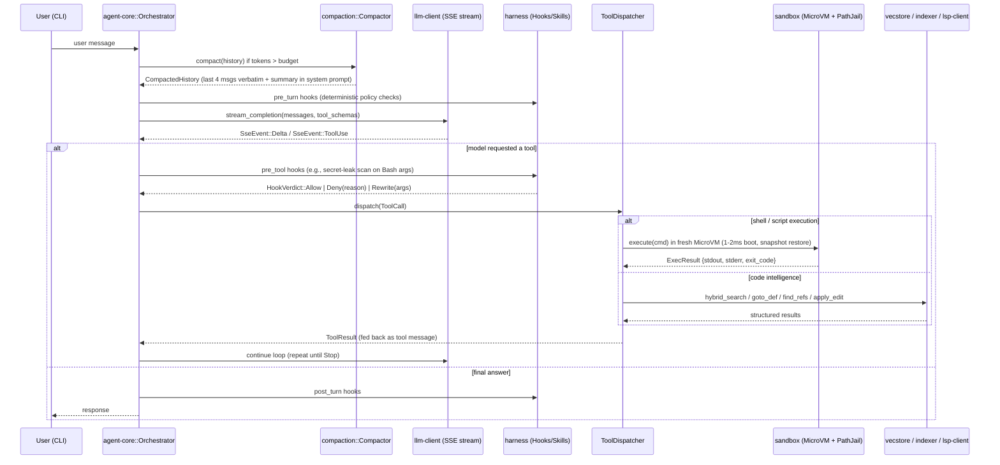
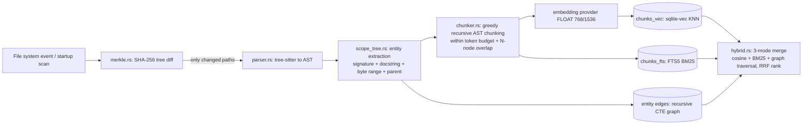
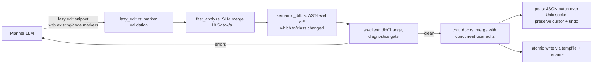

# ARCHITECTURAL BLUEPRINT — Autonomous Rust AI Coding Agent

> Companion file: `task.md`. Every task references sections in this document by anchor (e.g., `plan.md#3-core-traits--type-definitions`).
> Design invariants: **zero-cost abstractions, no `unwrap()` in library code, structured concurrency, everything local-first, eval-gated quality (no feature ships without a benchmark delta), English-only machine surfaces (prose may localize, parsers never do).**

---

## 1. High-Level System Design — Cargo Workspace Layout

The system is a single Cargo workspace with strictly decoupled crates. Dependency direction is **downward only** (no crate may depend on a crate listed below it).

```text
newgenrustcli/                      # workspace root
├── Cargo.toml                      # [workspace] members, shared lints, resolver = "2"
├── crates/
│   ├── agent-types/                # L0: shared enums/structs/errors. ZERO heavy deps (serde only)
│   │   └── src/{lib.rs, error.rs, message.rs, tool.rs, event.rs}
│   ├── runtime-core/               # L1: agentic loop scheduler, structured concurrency, cancellation
│   │   └── src/{lib.rs, scheduler.rs, task_scope.rs, event_bus.rs}
│   ├── llm-client/                 # L1: provider-agnostic LLM API + SSE streaming parser
│   │   └── src/{lib.rs, provider.rs, sse.rs, anthropic.rs, openai.rs}
│   ├── compaction/                 # L1: session compaction / context-window management
│   │   └── src/{lib.rs, config.rs, compactor.rs, token_count.rs}
│   ├── indexer/                    # L2: tree-sitter parsing, AST chunking, scope tree, Merkle sync
│   │   └── src/{lib.rs, parser.rs, chunker.rs, scope_tree.rs, merkle.rs, entity.rs}
│   ├── vecstore/                   # L2: SQLite + sqlite-vec + FTS5, hybrid 3-mode retrieval
│   │   └── src/{lib.rs, schema.rs, store.rs, hybrid.rs, graph.rs}
│   ├── lsp-client/                 # L2: tower-lsp based client, diagnostics ingestion
│   │   └── src/{lib.rs, client.rs, lifecycle.rs, diagnostics.rs, symbols.rs}
│   ├── apply-engine/               # L2: Fast-Apply SLM bridge, semantic diff, CRDT doc, IPC patches
│   │   └── src/{lib.rs, lazy_edit.rs, fast_apply.rs, semantic_diff.rs, crdt_doc.rs, ipc.rs}
│   ├── sandbox/                    # L2: MicroVM executor, path jail, SSRF-filtered network
│   │   └── src/{lib.rs, microvm.rs, path_jail.rs, net_guard.rs, snapshot.rs}
│   ├── harness/                    # L3: hooks, skills, sub-agents, policy engine, language guard
│   │   └── src/{lib.rs, hooks.rs, skills.rs, subagent.rs, policy.rs, lang_guard.rs}
│   ├── spec-pipeline/              # L3: RustySpec 7-stage pipeline (specify→analyze)
│   │   └── src/{lib.rs, stages.rs, artifacts.rs}
│   ├── state-store/                # L3: persistent (SOUL/HEARTBEAT/MEMORY .md) + ephemeral state
│   │   └── src/{lib.rs, persistent.rs, ephemeral.rs}
│   ├── mcp/                        # L3: MCP client + server (JSON-RPC over stdio/SSE)
│   │   └── src/{lib.rs, client.rs, server.rs, schema.rs}
│   ├── agent-core/                 # L4: turn-based orchestrator wiring everything together
│   │   └── src/{lib.rs, turn.rs, tools/, orchestrator.rs}
│   └── evals/                      # L5: evaluation harness — SWE-bench-lite runner, trajectory recorder, regression scoring
│       └── src/{lib.rs, swebench.rs, trajectory.rs, report.rs}
└── bin/
    └── cli/                        # L5: clap-based CLI entrypoint (the only binary)
        └── src/main.rs
```

**Crate-level dependency matrix (allowed edges only):**

| Crate | May depend on |
|---|---|
| `agent-types` | `serde`, `thiserror` only |
| `runtime-core`, `llm-client`, `compaction` | `agent-types` |
| `indexer`, `vecstore`, `lsp-client`, `apply-engine`, `sandbox` | `agent-types`, `runtime-core` |
| `harness`, `spec-pipeline`, `state-store`, `mcp` | all L0–L2 |
| `agent-core` | everything above |
| `evals` | `agent-core` (drives the full agent end-to-end; benchmark-harness crate, never a dependency of anything else) |
| `cli` | `agent-core`, `evals` |

---

## 2. Data Flow Diagrams

### 2.1 Request lifecycle: Agentic Loop → Tool Execution → Sandbox



### 2.2 Indexing pipeline: file change → Merkle diff → AST chunks → hybrid store



### 2.3 Edit application: Planner → Lazy Edit → Fast Apply → CRDT → Disk/Editor



---

## 3. Core Traits & Type Definitions

All types below live in `agent-types` unless annotated. Tasks in `task.md` must implement against **exactly** these signatures.

```rust
// ── agent-types/src/error.rs ─────────────────────────────────────────────
#[derive(Debug, thiserror::Error)]
pub enum AgentError {
    #[error("llm provider error: {0}")] Llm(String),
    #[error("tool `{name}` failed: {reason}")] Tool { name: String, reason: String },
    #[error("sandbox violation: {0}")] Sandbox(String),
    #[error("path jail violation: {0}")] PathJail(String),
    #[error("index error: {0}")] Index(String),
    #[error("storage error: {0}")] Storage(String),
    #[error("lsp error: {0}")] Lsp(String),
    #[error("cancelled")] Cancelled,
    #[error("io: {0}")] Io(#[from] std::io::Error),
}
pub type Result<T> = std::result::Result<T, AgentError>;

// ── agent-types/src/message.rs ───────────────────────────────────────────
#[derive(Clone, Debug, serde::Serialize, serde::Deserialize)]
pub enum Role { System, User, Assistant, Tool }

#[derive(Clone, Debug, serde::Serialize, serde::Deserialize)]
pub struct Message { pub role: Role, pub content: Vec<ContentBlock>, pub token_estimate: u32 }

#[derive(Clone, Debug, serde::Serialize, serde::Deserialize)]
pub enum ContentBlock {
    Text(String),
    ToolUse { id: String, name: String, input: serde_json::Value },
    ToolResult { tool_use_id: String, output: String, is_error: bool },
}

// ── agent-types/src/tool.rs ──────────────────────────────────────────────
#[derive(Clone, Debug, serde::Serialize, serde::Deserialize)]
pub struct ToolSchema { pub name: String, pub description: String, pub input_schema: serde_json::Value }

#[async_trait::async_trait]
pub trait Tool: Send + Sync {
    fn schema(&self) -> ToolSchema;
    async fn invoke(&self, input: serde_json::Value, ctx: &ToolCtx) -> Result<String>;
}

/// Everything a tool may touch. NO global state anywhere in the system.
pub struct ToolCtx {
    pub project_root: std::path::PathBuf,
    pub cancel: tokio_util::sync::CancellationToken,
}

// ── llm-client/src/provider.rs ───────────────────────────────────────────
#[derive(Debug)]
pub enum SseEvent {
    Delta(String),
    ToolUse { id: String, name: String, input: serde_json::Value },
    Stop { reason: StopReason },
    Error(String),
}
#[derive(Debug, PartialEq)] pub enum StopReason { EndTurn, ToolUse, MaxTokens }

#[async_trait::async_trait]
pub trait LlmProvider: Send + Sync {
    async fn stream(
        &self,
        messages: &[Message],
        tools: &[ToolSchema],
        cancel: &tokio_util::sync::CancellationToken,
    ) -> Result<tokio::sync::mpsc::Receiver<SseEvent>>;
}

// ── compaction/src/config.rs ─────────────────────────────────────────────
pub struct CompactionConfig {
    pub max_context_tokens: u32,
    pub keep_recent_messages: usize, // default = 4
    pub summary_target_tokens: u32,
}
pub trait Compactor: Send + Sync {
    /// Returns (new_system_suffix, retained_messages). Pure function — no I/O.
    fn compact(&self, cfg: &CompactionConfig, history: &[Message]) -> (String, Vec<Message>);
}

// ── harness/src/hooks.rs ─────────────────────────────────────────────────
#[derive(Debug)]
pub enum HookVerdict { Allow, Deny { reason: String }, Rewrite { new_input: serde_json::Value } }
#[derive(Clone, Copy, Debug)]
pub enum HookPoint { PreTurn, PreTool, PostTool, PostTurn }
#[async_trait::async_trait]
pub trait Hook: Send + Sync {
    fn point(&self) -> HookPoint;
    async fn evaluate(&self, tool_name: Option<&str>, payload: &serde_json::Value) -> Result<HookVerdict>;
}

// ── harness/src/skills.rs ────────────────────────────────────────────────
pub trait Skill: Send + Sync {
    fn name(&self) -> &str;
    /// Deterministic trigger, e.g. keyword/regex match on user message.
    fn matches(&self, user_message: &str) -> bool;
    fn system_prompt_fragment(&self) -> String;
}

// ── harness/src/subagent.rs ──────────────────────────────────────────────
#[async_trait::async_trait]
pub trait SubAgent: Send + Sync {
    /// Runs in an isolated context window; returns ONLY a summary string.
    async fn run(&self, task: String, ctx: &ToolCtx) -> Result<String>;
}

// ── indexer/src/entity.rs ────────────────────────────────────────────────
#[derive(Clone, Debug, serde::Serialize, serde::Deserialize)]
pub struct CodeEntity {
    pub id: u64,                    // stable hash of (path, kind, qualified_name)
    pub kind: EntityKind,
    pub qualified_name: String,     // e.g. "MyClass::my_method"
    pub signature: String,
    pub docstring: Option<String>,
    pub path: std::path::PathBuf,
    pub byte_range: (usize, usize),
    pub line_range: (u32, u32),
    pub parent_id: Option<u64>,     // scope tree edge
}
#[derive(Clone, Copy, Debug, serde::Serialize, serde::Deserialize)]
pub enum EntityKind { Function, Method, Class, Struct, Enum, Trait, Module, Block }

#[derive(Clone, Debug)]
pub struct Chunk {
    pub file: std::path::PathBuf,
    pub start_line: u32,
    pub end_line: u32,
    pub text: String,
    pub token_count: u32,
    pub entity_ids: Vec<u64>,
}

// ── vecstore/src/hybrid.rs ───────────────────────────────────────────────
#[derive(Clone, Copy, Debug)] pub enum SearchMode { Vector, Keyword, Graph, Hybrid }
#[derive(Clone, Debug)]
pub struct SearchHit {
    pub chunk_id: i64,
    pub file: std::path::PathBuf,
    pub start_line: u32,
    pub end_line: u32,
    pub score: f32,
    pub snippet: String,
}

#[async_trait::async_trait]
pub trait Retriever: Send + Sync {
    async fn search(&self, query: &str, mode: SearchMode, k: usize) -> Result<Vec<SearchHit>>;
}

// ── apply-engine/src/lazy_edit.rs ────────────────────────────────────────
pub struct LazyEdit {
    pub file: std::path::PathBuf,
    pub snippet: String, // contains "// ... existing code ..." markers
}
#[async_trait::async_trait]
pub trait ApplyStrategy: Send + Sync {
    async fn apply(&self, original: &str, edit: &LazyEdit) -> Result<String>; // merged file content
}

// ── sandbox/src/lib.rs ───────────────────────────────────────────────────
pub struct ExecResult { pub stdout: String, pub stderr: String, pub exit_code: i32, pub duration_ms: u64 }
#[async_trait::async_trait]
pub trait SandboxExecutor: Send + Sync {
    /// MUST run in an isolated MicroVM; network closed by default.
    async fn execute(&self, cmd: &str, timeout: std::time::Duration,
                     cancel: &tokio_util::sync::CancellationToken) -> Result<ExecResult>;
    async fn reset(&self) -> Result<()>; // restore clean snapshot
}

pub struct PathJail { root: std::path::PathBuf } // field private on purpose
impl PathJail {
    pub fn new(root: impl Into<std::path::PathBuf>) -> Result<Self>;       // canonicalizes root
    pub fn resolve(&self, user_path: &str) -> Result<std::path::PathBuf>;  // rejects escapes + symlink breakout
}

// ── agent-types/src/lang.rs ──────────────────────────────────────────────
#[derive(Clone, Copy, Debug, Default, PartialEq, serde::Serialize, serde::Deserialize)]
#[serde(rename_all = "lowercase")]
pub enum LanguageMode { #[default] En, Hinglish }

// ── harness/src/lang_guard.rs ────────────────────────────────────────────
/// Deterministic guard (implements `Hook`, fail-closed): prose may be
/// Hinglish, but EVERY machine-readable surface — JSON keys, tool names,
/// code identifiers, file paths, shell commands — MUST be ASCII English.
pub struct SchemaLangGuard;
impl SchemaLangGuard {
    /// Rejects non-ASCII / Devanagari (U+0900–U+097F) content in machine
    /// surfaces. Prose-valued fields are exempt via an explicit allowlist.
    pub fn assert_english_machine_surface(v: &serde_json::Value) -> Result<()>;
}

// ── evals/src/report.rs ──────────────────────────────────────────────────
#[derive(Clone, Debug, serde::Serialize, serde::Deserialize)]
pub struct EvalCase {
    pub id: String,
    pub repo_fixture: std::path::PathBuf, // local fixture checkout (local-first: no network needed to run evals)
    pub prompt: String,
    pub check_cmd: String,                // run in the sandbox; exit code 0 == pass
    pub timeout_secs: u64,
}
#[derive(Clone, Debug, serde::Serialize, serde::Deserialize)]
pub struct EvalOutcome {
    pub case_id: String,
    pub passed: bool,
    pub turns: u32,
    pub tool_calls: u32,
    pub wall_ms: u64,
    pub tokens_in: u64,
    pub tokens_out: u64,
}
```

**Cross-cutting rules for every crate:**
1. Public APIs return `agent_types::Result<T>` — never `panic!`, `unwrap`, or `expect` outside tests.
2. All async code runs on `tokio`; every spawned task takes a `CancellationToken` child token (structured concurrency: parent cancel implies children cancel).
3. `serde` derives on every wire/persisted type; `#[serde(deny_unknown_fields)]` on config structs.
4. No `unsafe` except inside `indexer::parser` (tree-sitter FFI), wrapped in a safe API with `// SAFETY:` comments.

---

## 4. Evaluation Harness Design (`evals`)

Goal: measure raw task-completion quality with hard data so claims of outperforming Kiro / Claude Code CLI are benchmark deltas, not vibes.

- **Suite format:** `.agent/evals/cases/*.toml` deserializing to `EvalCase` (section 3). Cases mirror SWE-bench-lite shape: a repo fixture, a natural-language task prompt, and a deterministic `check_cmd` (test suite) whose exit code decides pass/fail.
- **Isolation invariant:** every case gets a fresh copy of its fixture, a fresh `PathJail`, a fresh `Orchestrator`, and a fresh sandbox. Zero state reuse between cases — a leaked cache invalidates the measurement.
- **Outputs:** append-only JSONL. Results at `.agent/evals/results/<run-id>.jsonl` (`EvalOutcome` per line); full trajectories (every `AgentEvent`, message, tool call/result) at `.agent/evals/trajectories/<case>/<run-id>.jsonl`.
- **Regression rules:** *hard* regression = any case flipping pass→fail vs. the pinned baseline; *soft* regression = per-case turns +20% or tokens +30% (thresholds configurable). `cli eval diff` exits non-zero on hard regression — this is the CI quality gate.
- **Comparability:** metric names and pass criteria align with published SWE-bench-lite methodology so head-to-head numbers against competitor agents are directly comparable.

---

## 5. Localization Layer — Hinglish Mode

Target users: Hindi-speaking developers. Design decision: **Hinglish only (Hindi in the Latin/English alphabet); pure Devanagari script is intentionally unsupported** — it tokenizes 2–3x worse on mainstream models and triggers terminal grapheme-rendering and UTF-8/UTF-16 offset bugs.

- **Config:** `.agent/config.toml` field `language = "hinglish" | "en"` (default `"en"`), deserializing to `LanguageMode` (section 3).
- **Persistence:** the preference is a persona policy in `SOUL.md` under `## Policies` (`language: hinglish`), so it survives sessions. Precedence: an explicit `config.toml` value wins and is written through to `SOUL.md`; when config omits the field, `SOUL.md` decides.
- **The canonical LANG-GUARD RULE** — injected verbatim into the system prompt by the `hinglish-mode` skill and enforced deterministically by `SchemaLangGuard`:

```text
LANG-GUARD RULE:
Reasoning, planning, and explanations: Hinglish (Hindi written in the
English/Latin alphabet) ONLY.
The following MUST remain strictly English/ASCII, with NO exceptions:
  - code blocks and all identifiers (variables, functions, types, modules)
  - tool call names and every JSON key in tool inputs and schemas
  - file paths, shell commands, and CLI flags
  - spec artifact headers and any machine-parsed markdown structure
```

- **Two-layer enforcement:** (a) prompt-level via the skill fragment (guidance, not trust); (b) deterministic post-hoc via `SchemaLangGuard` (a `Hook`, fail-closed like all hooks). A Devanagari codepoint or non-ASCII JSON key on any machine surface converts the offending tool call into `ToolResult { is_error: true }` with an English corrective message the model can recover from — parsers never see mixed-language keys, and the process never crashes.
- **Scope boundary:** localization touches the *prose channel only* — user-facing explanations, plans, clarifying questions, diagnostics summaries. Spec artifacts keep English structural headers (`## User Stories` etc.) with Hinglish permitted inside prose paragraphs (section enforced by TASK-11.2).
